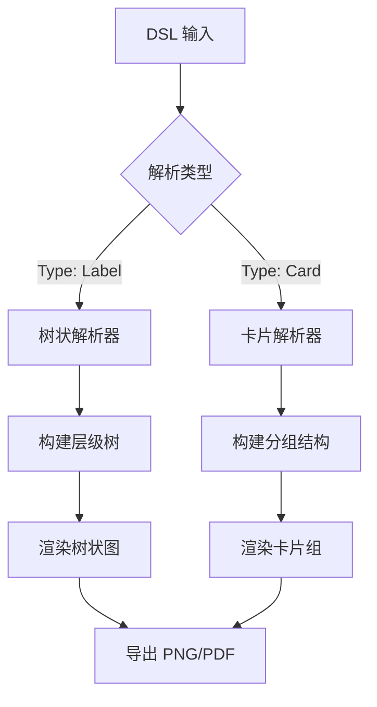

# 亲和图 (Affinity Diagram / KJ法) 组件设计方案

## 背景概述

亲和图是一种将大量看似无关的信息进行分组、归类并找出其内在关系的分析工具，也称为 **KJ 法**（以其发明者川喜田二郎 Kawakita Jiro 命名）。本设计旨在为 Smart QC Tools 新增亲和图组件，继承现有组件的设计风格并提供灵活的 DSL 描述语言。

## 参考图片分析

````carousel

<!-- slide -->

````

| 图片 | 类型 | 特点 |
|------|------|------|
| 图1 | **Label 型** (树状) | 层级清晰、自上而下、圆角矩形节点、连线连接 |
| 图2 | **Card 型** (卡片) | 分组卡片、颜色区分、垂直瀑布流、无显式连线 |

---

## 亲和图 DSL 规范设计

### 1. 基础语法结构

```kj
Title: [标题文字]
Type: Label | Card

# 配置项
Color[Header/Card/Item/Line]: #HEX
Font[Title/Header/Item]: [Size]
Layout: Vertical | Horizontal

# 数据定义
Item: {ID}, {内容}, {父ID?}
```

---

### 2. 完整 DSL 语法规范

#### 2.1 标题与类型设定

| 语法 | 说明 | 取值 | 示例 |
|------|------|------|------|
| `Title: [文字]` | 图表主标题 | 任意文字 | `Title: 如何提升团队效率` |
| `Type: [类型]` | 图表渲染类型 | `Label` / `Card` | `Type: Card` |
| `Layout: [布局]` | 布局方向 | `Vertical` / `Horizontal` | `Layout: Horizontal` |

> [!NOTE]
> - **Label 型**：适合展示清晰的层级关系，采用树状结构，节点间有连线
> - **Card 型**：适合头脑风暴结果展示，采用卡片分组，视觉上更紧凑

---

#### 2.2 色彩配置

| 语法 | 作用对象 | 默认值 | 示例 |
|------|----------|--------|------|
| `Color[Title]: #HEX` | 主标题背景色 | `#1e293b` | `Color[Title]: #374151` |
| `Color[Header]: #HEX` | 分组头部背景色 (Card型) | `#f59e0b` | `Color[Header]: #10b981` |
| `Color[Card]: #HEX` | 卡片背景色 | `#ffffff` | `Color[Card]: #fef3c7` |
| `Color[Item]: #HEX` | 叶子项背景色 | `#e2e8f0` | `Color[Item]: #dbeafe` |
| `Color[Line]: #HEX` | 连接线颜色 (Label型) | `#64748b` | `Color[Line]: #3b82f6` |
| `Color[Text]: #HEX` | 文字颜色 | `#1e293b` | `Color[Text]: #0f172a` |
| `Color[Border]: #HEX` | 边框颜色 | `#cbd5e1` | `Color[Border]: #94a3b8` |

---

#### 2.3 字号配置

| 语法 | 作用对象 | 默认值 | 示例 |
|------|----------|--------|------|
| `Font[Title]: [N]` | 主标题字号 | `20` | `Font[Title]: 24` |
| `Font[Header]: [N]` | 分组头部字号 | `16` | `Font[Header]: 18` |
| `Font[Item]: [N]` | 数据项字号 | `14` | `Font[Item]: 12` |

---

#### 2.4 数据项定义

**核心语法**：`Item: {ID}, {内容}, {父ID?}`

| 字段 | 说明 | 必填 | 示例 |
|------|------|------|------|
| `{ID}` | 唯一标识符 | ✓ | `A1`, `idea_01` |
| `{内容}` | 显示内容 | ✓ | `征求孩子们的意见` |
| `{父ID}` | 所属父容器ID | ✗ | `A`, `group_1` |

**层级规则**：
1. **无父ID** → 一级容器（根节点或分组头）
2. **有父ID** → 该项作为父容器的子项
3. **被其他Item引用为父** → 自动升级为容器

---

#### 2.5 简化语法（Markdown 风格）

为提高可读性，支持类 Markdown 的缩进语法：

```kj
Title: [标题]
Type: Label | Card

# 一级分组标题
## 二级子项
### 三级子项
## 另一个二级子项

# 另一个一级分组
## ...
```

| 语法 | 层级 | 说明 |
|------|------|------|
| `# [文字]` | Level 1 | 一级容器/分组头 |
| `## [文字]` | Level 2 | 二级子项 |
| `### [文字]` | Level 3 | 三级子项 |
| `#### [文字]` | Level 4 | 四级子项（最深） |

---

### 3. 完整示例

#### 3.1 Label 型（树状层级）示例

```kj
Title: 如何提升产品交付质量
Type: Label
Layout: Horizontal
Color[Title]: #1e293b
Color[Line]: #64748b
Color[Item]: #dbeafe
Font[Title]: 22
Font[Header]: 16
Font[Item]: 14

# 流程改进
## 引入代码审查机制
### 每日 Code Review
### 自动化静态分析
## 规范化需求文档
### 使用标准模板
### 需求评审会议

# 人员培训
## 技术能力提升
### 内部技术分享
### 外部培训课程
## 沟通能力培养

# 工具升级
## 自动化测试
## CI/CD 流水线优化
```

---

#### 3.2 Card 型（卡片分组）示例

```kj
Title: 为家庭计划一个愉快的假期涉及哪些重要的问题?
Type: Card
Layout: Horizontal
Color[Title]: #6b7280
Color[Header]: #f59e0b
Font[Title]: 18

# 统一全家对理想假期的看法
## 征求孩子们的意见
## 考虑每个人的爱好
## 翻阅家庭图片

# 确定最大的开支
## 找到几种价钱范围
## 将假期与出差联系起来
## 确定总支出

# 利用各种渠道研究如何度假
## 联系一个有创见的旅行社
## 找到各年龄层次都有活动的地方
## 回忆以往经历
```

---

#### 3.3 精确 Item 定义示例

```kj
Title: 项目风险分析
Type: Card
Layout: Vertical

Item: root, 项目风险分析
Item: G1, 技术风险, root
Item: G1-1, 架构复杂度过高, G1
Item: G1-2, 第三方依赖不稳定, G1
Item: G2, 管理风险, root
Item: G2-1, 需求变更频繁, G2
Item: G2-2, 资源分配不均, G2
Item: G3, 外部风险, root
Item: G3-1, 政策法规变化, G3
```

---

### 4. 类型对照表

| 特性 | Label 型 | Card 型 |
|------|----------|---------|
| **视觉风格** | 树状图、节点连线 | 卡片分组、瀑布流 |
| **适用场景** | 展示层级关系、因果逻辑 | 头脑风暴结果、归纳汇总 |
| **布局方式** | 自上而下/自左向右 | 横向并列卡片组 |
| **最大层级** | 4级 | 3级 (Header → Cards → Items) |
| **连线** | ✓ 有 | ✗ 无 |
| **颜色区分** | 按层级统一色 | 按分组自定义色 |

---

### 5. DSL 解析规则



---

### 6. 数据模型设计

```typescript
// types.ts
export interface AffinityItem {
    id: string;
    label: string;
    parentId?: string;
    children?: AffinityItem[];
    color?: string;  // 单项颜色覆盖
}

export interface AffinityChartStyles {
    title?: string;
    type?: 'Label' | 'Card';
    layout?: 'Vertical' | 'Horizontal';
    titleColor?: string;
    headerColor?: string;
    cardColor?: string;
    itemColor?: string;
    lineColor?: string;
    textColor?: string;
    borderColor?: string;
    titleFontSize?: number;
    headerFontSize?: number;
    itemFontSize?: number;
}

export interface AffinityChartRef {
    exportPNG: (transparent?: boolean) => void;
    exportPDF: () => void;
}
```

---

### 7. 与 chart_spec.json 集成

需在 `chart_spec.json` 的 `chart_grammars` 中新增：

```json
"affinity": {
    "type": "logic",
    "intent_trigger": [
        "亲和图",
        "KJ法",
        "归纳分组",
        "头脑风暴",
        "affinity"
    ],
    "dsl_specification": {
        "rules": [
            "Title: [文字] - 主标题",
            "Type: Label/Card - 图表类型",
            "Color[Title/Header/Card/Item/Line]: #HEX",
            "Font[Title/Header/Item]: [Size]",
            "# L1 ## L2 ### L3 - 层级语法",
            "Item: {ID}, {内容}, {父ID?} - 精确定义"
        ],
        "few_shot_examples": [...]
    }
}
```

---

## 验证计划

### 自动化验证
- 单元测试：DSL 解析器测试
- 渲染测试：Label/Card 两种类型渲染正确性

### 手动验证
- 使用示例 DSL 验证渲染效果
- 验证导出功能（PNG/PDF）

---

## 下一步计划

1. 确认 DSL 规范设计是否满足需求
2. 实现 `types.ts` 类型定义
3. 实现 DSL 解析器
4. 实现 `AffinityChart.tsx` 组件
5. 集成到主应用并更新 `chart_spec.json`
